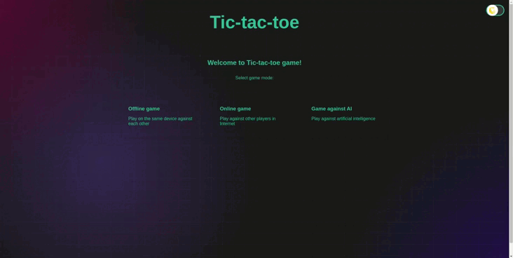

# Крестики-нолики

Онлайн-версия: https://tic-tac-toe-tan-zeta.vercel.app/

Игра Крестики-нолики с современным интерфейсом. Играйте с другом на одном устройстве, отслеживайте историю ходов и настраивайте внешний вид под себя.

## Что умеет игра

- 🎮 Классическое поле 3x3
- 📜 История ходов с возможностью вернуться назад
- 🌓 Тёмная и светлая темы
- 💾 Автосохранение игры
- 🔍 Подсветка последнего хода и выигрышной комбинации
- 🧭 Навигация между страницами
- В настоящее время в арзработке находится два режима игры: игра онлайн и игра против ИИ.

## Технологии

- **React 18** - современная библиотека для создания интерфейсов
- **TypeScript** - для надёжного и типобезопасного кода
- **React Router** - для навигации между страницами
- **React Context** - для управления состоянием
- **SCSS Modules** - для стилизации компонентов
- **Vite** - быстрый инструмент сборки
- **LocalStorage** - для сохранения прогресса

## Быстрый старт

```bash
# Установка
npm install

# Запуск
npm run dev
```

## Как играть

1. Игроки по очереди ставят X или O на поле
2. Цель - собрать три своих символа в ряд
3. Используйте кнопки истории для отмены ходов
4. Переключайте тему с помощью кнопки ☀️/🌙
5. Ваш прогресс сохраняется автоматически
